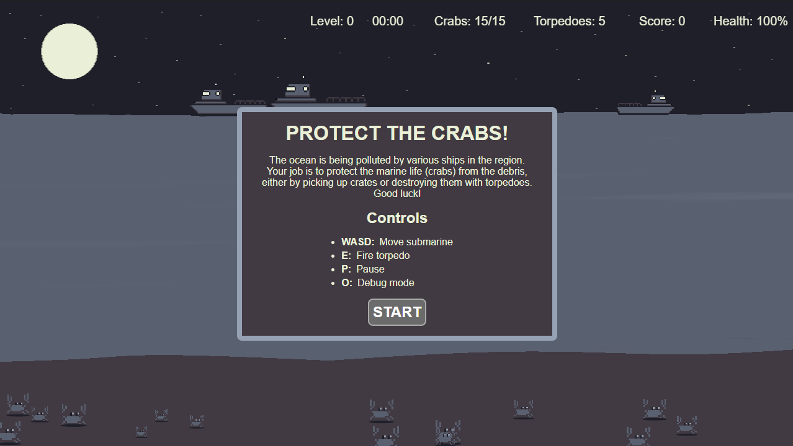

# Protect the crabs

Protect the crabs is a small game made during Ludum Dare 56. 
The main goal of the game is to protect crabs from being hit by debris dropped by various ships above. 
If this if achieved within a given time frame, the level and difficulty increases.

## Controls
<b>WASD</b>: Change the direction of the submarine  
<b>E</b>: Fire torpedo  
<b>P</b>: Pause  
<b>O</b>: Debug mode

## Sound effects
Sound effect were provided by [mixkit.co](https://mixkit.co/license/#sfxFree)
